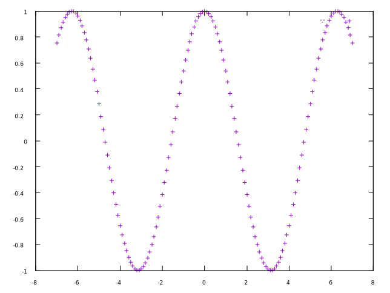
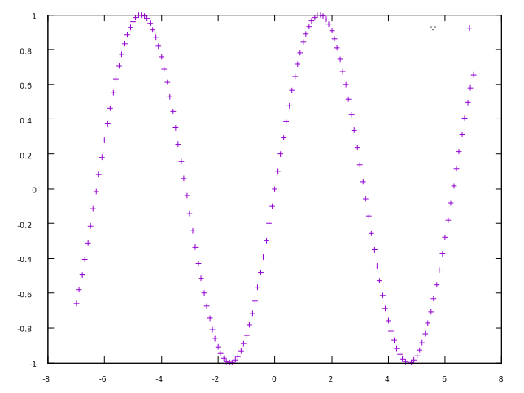
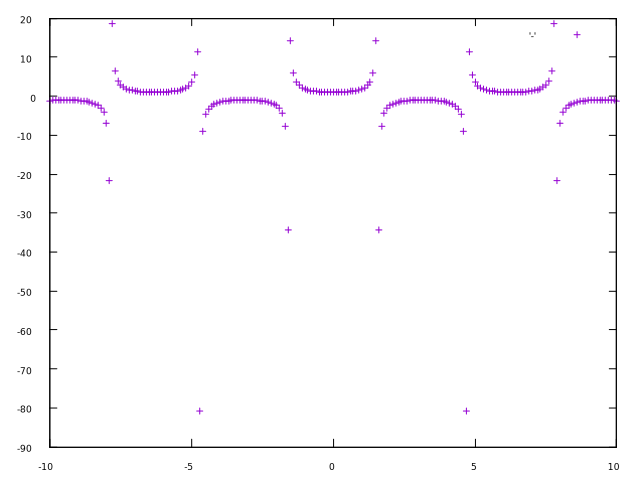
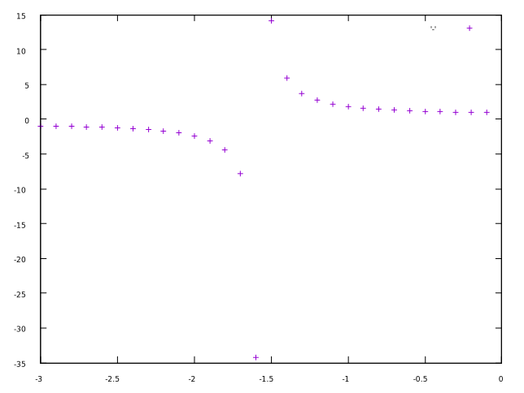
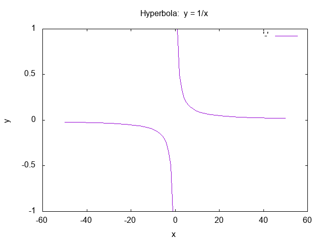

# cnumerics 
### simple examples on numerical operations in c language
by Francesco Lazzarotto fralaz1971@gmail.com
## How to run the examples
The simpler way is to use a shell terminal and gcc compiler in a unix-like
environment like [GNU](https://www.gnu.org) [bash](https://www.gnu.org/software/bash) 
terminal in GNU/Linux or MacOS or msys2 terminal on MicroSoft Windows.
Other c [compilers](https://en.wikipedia.org/wiki/Compiler) / [terminals](https://en.wikipedia.org/wiki/Terminal_emulator) / [shells](https://en.wikipedia.org/wiki/Shell_(computing)) 
are suitable too, as well as an [IDE](https://en.wikipedia.org/wiki/Integrated_development_environment)
### VERY IMPORTANT !! ### 
all the command lines examples you see below typed at the terminal console (or similar ones), 
can be also inserted in an automated script and be launched as a single program, also clicking on 
an icon with the mouse. 
The terminal emulator will help you to understand how to compose commands and create scripts.
### 
### to configure on bash shell
	./configure
#
### to compile
	make
### to execute
	./<program> arg1 arg2 ... argn
	n can be = 0 , so in this case:
	./<program>
### e.g.
	./loopint 10 20
### to install (mv all executable program files in the directory bin)
### to remove generated files:
	make clean
### trying different values
	./loopint -10 -5
	./loopint -10 0
	./loopint -100 99
### going close to and beyond the upper linit
	./loopint 2147483640 2147483644
	./loopint 2147483640 2147483648
	./loopint 2147483640 2147483650
### what happens in this case??? why?
	./loopint 2147483644 2147483646
### to save on an output ascii file
	./loopint -5 5 > outdata.dat
### doublevec reads an array from stdin and prints out it doubled on stdout
### e.g.
	./doublevec 4 < data2.dat
#
	./doublevec 15 < data2.dat > dubdata.dat
### cat program may be used to see the content of a text file
	cat dubdata.dat
### on MicroSoft Windows or FreeDOS you can use type command instead
	type dubdata.dat
### without redirecting stdin from file, this accepts from keyboard input (from stdin)
	./doublevec 4
### to clean all generated files for saving only the source code in the project
	make distclean
## Plotting data points
Generated data points can be plotted on the screen, the simpler way is to
use an external (free and open source) program called [gnuplot](https://www.gnuplot.info) .
gnuplot is a widely used and portable application to create graphics of calculus functions or sample data points, and fit them. It has graphical user interfaces or can be called by scripts or
executed on the terminal command line.
can be [downloaded](https://sourceforge.net/projects/gnuplot/files/gnuplot/)
from its sourceforge page https://sourceforge.net/projects/gnuplot/files/gnuplot
### example for plotting function data points
	./cosin -7 7 0.1 | gnuplot -p -e "plot '-'"

    ./sin -7 7 0.1 | gnuplot -p -e "plot '-'"

	./1_div_cos -10 10 0.1   | gnuplot -p -e "plot '-'"

	./1_div_sin -10 10 0.1   | gnuplot -p -e "plot '-'"
	
	./1_div_cos -3 -0.01 0.1 | gnuplot -p -e "plot '-'"

### on the bash terminals (in linux or msys2/mingw on MS Win)
### it is possible to simplify the call to gnuplot with an alias
	alias gp="gnuplot -p -e \"plot '-'\""
### after that, the previous commands become
	./cosin -7 7 0.1 | gp
	./sin -7 7 0.1 | gp
	./1_div_cos -10 10 0.1   | gp
	./1_div_sin -10 10 0.1   | gp
	./1_div_cos -3 -0.01 0.1 | gp
## defining an alias plot command in bash
to simplify your command lines you can define plotting with lines instead of points, this way
	alias gpl="gnuplot -p -e \"plot '-' with lines\""
so you can run this
	./hyperbola -50 50 1 | gpl
## the following will create a file named hyperbola.png with the hyperbola graph
	./hyperbola -50 50 1 | gnuplot -p -e "set term png;set output 'hyperbola.png';set xlabel 'x'; set ylabel 'y'; set title 'Hyperbola:  x = 1/x'; plot '-' with lines"

#
of course when the plot become complex it's worth writing a gnuplot command file
pow.c raise to power math.h function usage example
parpow.c pow() usage example, x, y are give as program command line parameters
	make parpow
	./parpow 10 -2
	./parpow: compute x raised to y power
	usage: ./parpow <x> <y>

### fpow.c reads <n> input data (x,y) couples from text file and outputs pow(x,y)
	make fpow
	./fpow invals1.txt 2>err.log
	cat err.log
### fun1.c explain how to create and use c functions
fun1 needs two input parameters:

    francesco@squirrel:~/projects/c_cpp/cnumerics$ ./fun1 
    ./fun1: ERROR, too few program arguments!
    usage: ./fun1 <operand1> <operand2>
    ./fun1: <operand1> and <operand2> are expected to be integer numbers
#
when <operand1> and <operand2> are valid integer numbers, the implemented function alpha()
will return an integer output value applying the formula

    4 + (<operand1> * <operand2>)

you can modify the formula applied in the alpha() function, without modifying the
programming interface you use in the code inside the main() when you call (=use) the alpha()
function.
#
    francesco@squirrel:~/projects/c_cpp/cnumerics$ ./fun1 10 20 
    ./fun1: testing the use of a function
    ./fun1: the result of alpha(10, 20) is 204
    204
#
    francesco@squirrel:~/projects/c_cpp/cnumerics$ ./fun1 10 20 2>err.log
    204
note how we get only the result number as output in the last run, all the messages flew into
the file err.log
#
    francesco@squirrel:~/projects/c_cpp/cnumerics$ cat err.log
    ./fun1: testing the use of a function
    ./fun1: the result of alpha(10, 20) is 204
#
    francesco@squirrel:~/projects/c_cpp/cnumerics$ ./fun1 10 20 20 12 "ciao"; printf "\n return value from main() is $?\n"
    ./fun1: WARNING, too many program arguments
    usage: ./fun1 <operand1> <operand2>
    ./fun1: you gave 5 command line arguments to ./fun1
    ./fun1: arguments after the 2nd will be ignored
    ./fun1: testing the use of a function
    ./fun1: the result of alpha(10, 20) is 204
    204 
    return value from main() is 2
### rndicples.c --> generate couples of random integer values
### that can be saved on a file and used as input for fpow
	./rndicples <<< "-5 12 6" > invals6.txt
	./fpow invals6.txt 2>err.log

### list of the programs
    tree ../cnumerics
    ├── 1_div_cos.c
    ├── 1_div_sin.c
    ├── 3pcircle.c
    ├── accuracy.c
    ├── arrays2.c
    ├── arrays.c
    ├── bases.c
    ├── bignum.c
    ├── bin
    ├── blowup.c
    ├── c2f.c
    ├── checkprimenoret.c
    ├── checkprimeret.c
    ├── checkprimevoid.c
    ├── cnumerics.pro
    ├── conbinatorics.c
    ├── conbinatorics.h
    ├── configure
    ├── configure.bat
    ├── configure.sh
    ├── configure-win-i686-mingw.sh
    ├── configure-win-mingw.sh
    ├── configure-win-vc.sh
    ├── const.c
    ├── cosin.c
    ├── couples.c
    ├── crossinglines.png
    ├── data2.dat
    ├── data2x2.dat
    ├── decodd.c
    ├── deg2rad.c
    ├── dices.c
    ├── doublerow.c
    ├── doublevec.c
    ├── errvals.h
    ├── e_what.c
    ├── floatformats.c
    ├── floatlimits.c
    ├── fpow.c
    ├── fun1.c           ----> on the use of a c function (and simple err/msg handling)
    ├── gimme_five.c
    ├── gimme_numbers.c
    ├── gravity.c
    ├── gravity.h
    ├── hyperbola.c
    ├── hyperbola.png
    ├── incodd.c
    ├── install.bat
    ├── install.sh
    ├── intlimits.c
    ├── invals0.txt
    ├── invals1_5.txt
    ├── invals1.txt
    ├── invals2.txt
    ├── invals40.txt
    ├── invals6.txt
    ├── invals.txt
    ├── LICENSE
    ├── lights2.c
    ├── limits.c
    ├── linescrossf.plt
    ├── linescross.plt
    ├── loopbyte.c
    ├── loopint.c
    ├── Makefile
    ├── Makefile.lnx
    ├── outdata.dat
    ├── parabola.c
    ├── parpow.c
    ├── pi.c
    ├── plothyperbola.bat
    ├── plothyperbola.sh
    ├── plotparabola.bat
    ├── plotparabola.sh
    ├── pow.c
    ├── precision.c
    ├── predecodd.c
    ├── preincodd.c
    ├── printval.c
    ├── printwidth.c
    ├── random1.c
    ├── random2.c
    ├── README
    ├── README-c-integers
    ├── realarrays.c
    ├── rndicples.c
    ├── rndrcples.c
    ├── setup.bat
    ├── setup.sh
    ├── shares.c
    ├── simpshares.c
    ├── sin.c
    ├── sizes.c
    ├── solvequad.c
    ├── sum10.c
    ├── sum10.dat
    ├── sum4co.c
    ├── sum4co.dat
    ├── taxes.c
    ├── test_limits.c
    ├── toobig.c
    ├── ugravity.c
    ├── uninstall.sh
    ├── utility.h
    ├── voidprint5.c
    └── words.txt

    1 directory, 106 files
